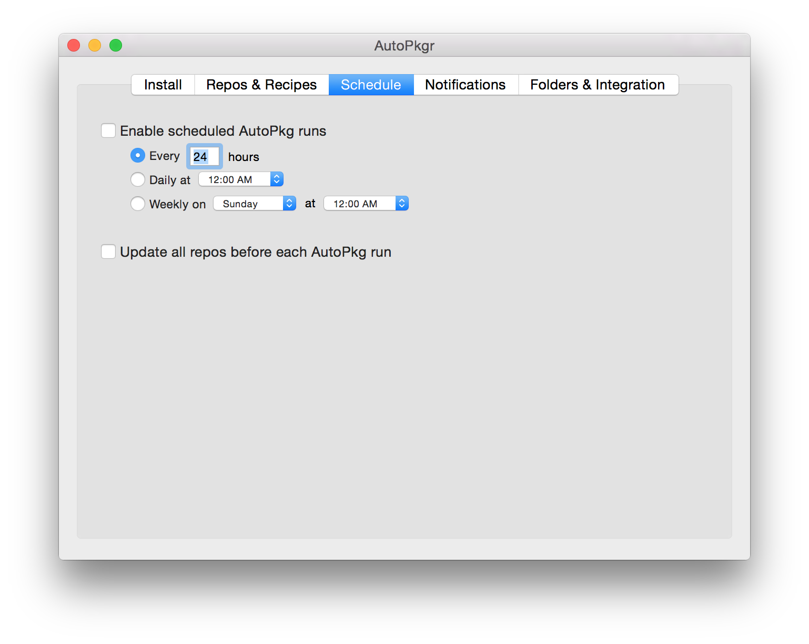
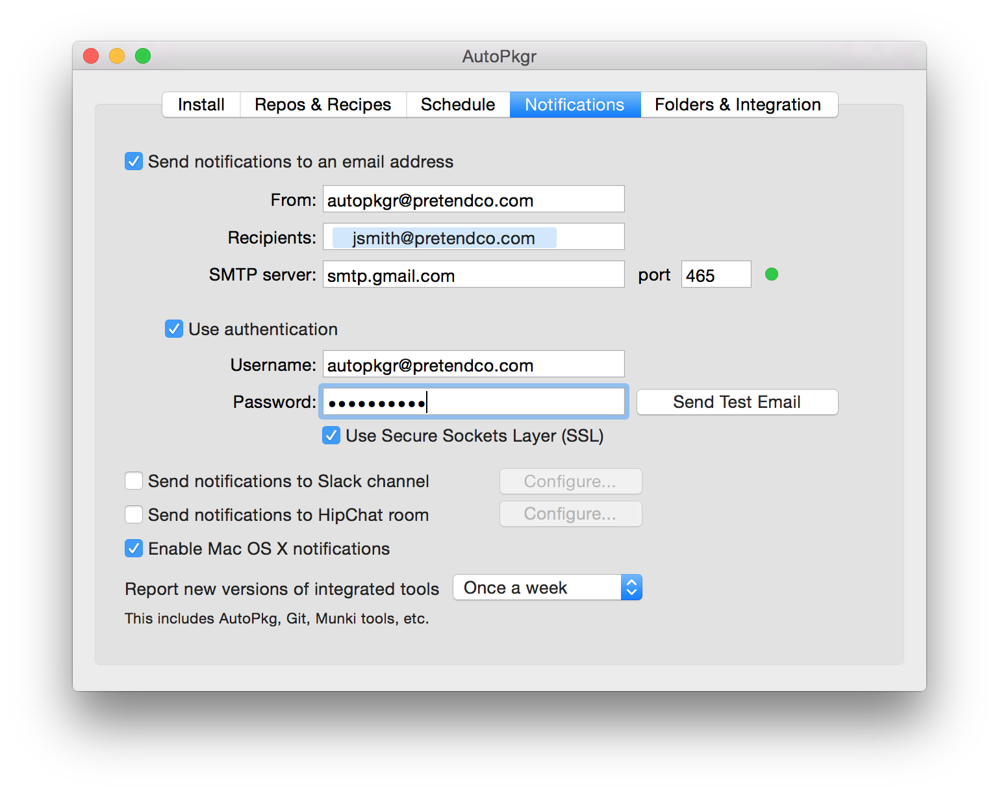
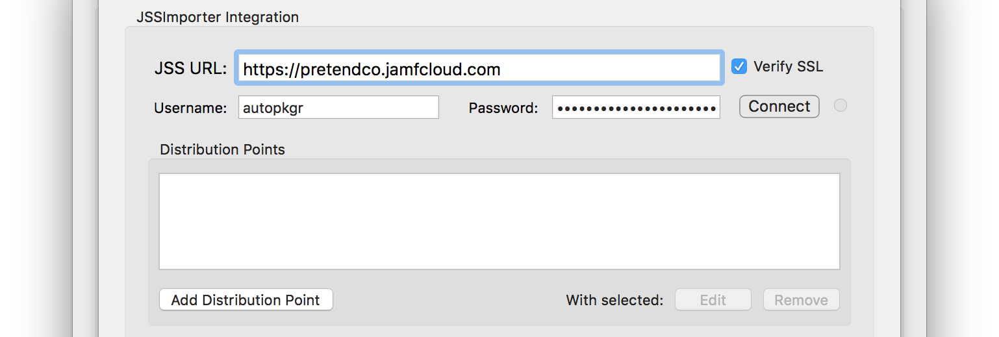

# AutoPkgr


AutoPkgr is a free Mac app that makes it easy to install and configure [AutoPkg](https://autopkg.github.io/autopkg/).

AutoPkg is an awesomely powerful tool for automating OS X software packaging and distribution, but it requires its users to be comfortable with command-line tools and methods.

If you're not yet comfortable with the command-line, or if you just want to get AutoPkg set up from scratch quickly and reliably, AutoPkgr is for you. You can find the latest release [here](https://github.com/lindegroup/autopkgr/releases/latest).


<!-- MarkdownTOC autolink=true depth=3 bracket=round -->

- [Features](#features)
- [Installation](#installation)
- [Basic Usage](#basic-usage)
- [Searching for Recipes](#searching-for-recipes)
- [Creating/Editing Recipe Overrides](#creatingediting-recipe-overrides)
- [Integrations](#integrations)
    - [Integration with Munki](#integration-with-munki)
    - [Integration with Casper](#integration-with-casper)
    - [Integration with Absolute Manage](#integration-with-absolute-manage)
    - [Integration with MacPatch](#integration-with-macpatch)
- [Using a Proxy](#using-a-proxy)
- [Troubleshooting](#troubleshooting)
- [Credits](#credits)

<!-- /MarkdownTOC -->


## Features

AutoPkgr makes these tasks a piece of cake:

- Installation of AutoPkg itself.
- Installation of Git, which AutoPkg requires.
- Discovery of and subscription to the repositories and recipes you need.
- Automatic scheduled checks of the recipes you choose.
- Email, Slack, or HipChat notifications when new software is packaged.
- Ability to easily create and edit AutoPkg recipe overrides.
- One-click access to common folders that AutoPkg admins need.
- Basic integration of AutoPkg with popular software distribution frameworks like [Munki](https://www.munki.org/munki/), [Casper Suite](http://www.jamfsoftware.com/products/), [Absolute Manage](https://www.absolute.com/en/products/absolute-manage), and [MacPatch](https://macpatch.github.io/).


## Installation

AutoPkgr requires Mac OS X 10.8 or higher. If you plan on integrating with Munki, Casper, or other tools, additional requirements may apply. (See the [Integrations](#integrations) section for details.)

Download the [latest release](https://github.com/lindegroup/autopkgr/releases/latest), and drag the AutoPkgr app to your Applications folder. Then launch it.


## Basic Usage

1.  Launch the AutoPkgr app.

1.  On first launch, you'll see the configuration window:
    

1.  Click the button to __Install Git__ if it's not already installed.

1.  Click the button to __Install AutoPkg__ if it's not already installed.

1.  Switch to the __Repos & Recipes__ tab.
    

1.  Select the repositories you'd like to subscribe to. We recommend adding the "default" repo to get you started:
    

    You can also add repositories manually using the "Add a repo URL manually" field.
    

1.  Select any recipes you wish to subscribe to.

    You can search for recipes using the "Search for a recipe on GitHub" field.

1.  Switch to the __Schedule__ tab.
    

1.  Set your automatic update checking preferences. Most people like to check about once per day.

    :warning: &nbsp; Only choose "Update all repos before each AutoPkg run" if you know and trust the authors of the recipes you subscribe to.

1.  Switch to the __Notifications__ tab.
    

1.  Configure email, Slack, or HipChat notifications as desired.

That's it! AutoPkgr will now check for the latest app updates you specified, and when an update is available you'll receive a notification.

&nbsp;

Anytime you'd like to make changes to AutoPkgr's configuration, just click on the AutoPkgr icon in the menu bar (), and choose __AutoPkgr Preferences...__

You'll also find some useful shortcuts on the __Folders & Integration__ tab, which will take you directly to several convenient AutoPkg folders. On that tab, you can also configure integration with Munki, Casper, and other software deployment systems (see below).


## Searching for Recipes

AutoPkgr can help you find recipes for the apps you want. In the __Recipes & Repos__ tab, enter the name of the app into the "Search for a recipe on GitHub" field, and click __Search__.


From the list of results, select your desired recipe. If the repo is not already added (as shown by the green indicator), then click __Add Repo__.


Click __Close__ to return to the recipe list. Then you should see the newly-added recipe in your available recipes list. Click the checkbox next to the recipe you want, and it will be included in future scheduled AutoPkg runs.


Don't see a recipe for an app you use? [Write one](https://github.com/autopkg/autopkg/wiki/Recipe-Format)!


## Creating/Editing Recipe Overrides

We've tried to simplify the process of creating and editing AutoPkg recipe overrides for you. Just right-click on a recipe in the list, and you'll see options for creating an override, editing an existing override, and choosing which text editor you prefer to use.


## Integrations

AutoPkgr makes it as easy as possible to integrate with these software distribution systems:

### Integration with Munki

:bulb: &nbsp; _Note: Requires the [Munki tools](https://www.munki.org/munki/) to be installed on the Mac running AutoPkgr._

To configure AutoPkgr to add updates directly into your Munki repository, follow these steps:

1. Click on the __Folders & Integration__ tab.
1. If Munki tools are not already installed, click on the __Install Munki tools__ button. Enter your password if prompted.
1. If your Munki repo is not located at `/Users/Shared/munki_repo`, click on the __Configure Munki tools...__ button, click __Choose__, and browse to your munki_repo.
    
1. Click __Close and Save__.

You'll also want to make sure you have `.munki` recipes selected for each app you want to import. Once the new versions of apps appear in your Munki repo, you can add them to the appropriate catalogs and manifests to deploy them.

### Integration with Casper

:bulb: &nbsp; _Note: Requires Casper version 9 or newer._

To configure AutoPkgr to create Self Service policies in Casper for new app updates, follow these steps:

1. Create a static computer group on your JSS called __Testing__. Add one or more test computers to the group.
1. Create an account on your JSS with __Create__, __Read__, and __Update__ access to the following objects:
    - __Categories__
    - __Computer Extension Attributes__
    - __File Share Distribution Points__ (only needs Read access)
    - __Packages__
    - __Policies__
    - __Scripts__
    - __Smart Computer Groups__
    - __Static Computer Groups__
1. Open AutoPkgr and go to the __Folders & Integration__ tab.
1. Click the __Install JSSImporter__ button. Enter your password if prompted.
1. Click on __Configure JSSImporter__.
1. Enter your JSS URL, API username, and API password. Then click __Connect__.
    
1. When prompted, enter the read/write password for each distribution point.
1. Click __Close and Save__.

You'll also want to make sure you have a few `.jss` recipes selected. AutoPkgr will automatically add the "official" [jss-recipes](https://github.com/autopkg/jss-recipes) repo so you'll have a few to choose from right away.

When a `.jss` recipe runs, the package is uploaded to your distribution points, a Self Service policy is created and scoped to a new smart group. As a result, computers in the Testing group with less than the latest version of the app should now be able to install the latest version through Self Service.

For detailed information on JSS recipe behavior, check out the [README for jss-recipes](https://github.com/autopkg/jss-recipes), and for some examples of advanced worfklows, see [Auto Update Magic](https://github.com/homebysix/auto-update-magic).

### Integration with Absolute Manage

:warning: &nbsp; _Absolute Manage integration is still in beta. We welcome [your feedback](https://github.com/lindegroup/autopkgr/issues/new)._

:bulb: &nbsp; _Notes and requirements for Absolute Manage integration:_

- _Absolute Manage version 6.5 or newer is required._
- _The Absolute Manage Admin app should be installed in your Applications folder._
- _Launch Absolute Manage Admin and connect the app to your Absolute Manage server._
- _In order to run `.absolute` recipes, your Mac needs to be logged in and the Absolute Manage Admin app needs to be running._

To configure AutoPkgr to add updates directly into your Absolute Manage server, follow these steps:

1. Click on the __Folders & Integration__ tab.
1. Click on the __Install AMExporter__ button. Enter your password when prompted.
1. Click on the __Configure AMExporter...__ button. Select the __Enable External SD Package Upload__ option if desired.
    
1. Click __Close and Save__.

You'll also want to make sure you have a few `.absolute` recipes selected. There is no official repository for Absolute Manage recipes yet, but if you add the `seansgm-recipes` repository, you'll see a few to get you started.

### Integration with MacPatch

:warning: &nbsp; _MacPatch integration is still in beta. We welcome [your feedback](https://github.com/lindegroup/autopkgr/issues/new)._

:bulb: &nbsp; _Note: Requires you to have the default recipe repo added._


To configure AutoPkgr to add updates directly into your MacPatch server, follow these steps:

1. Click on the __Folders & Integration__ tab.
1. Click on the __Install MacPatchImporter__ button. Enter your password when prompted.
1. Click on the __Configure MacPatchImporter...__ button. Enter the URL, username, and password for your MacPatch server.
    
1. Click __Close and Save__.


## Using a Proxy

If your network uses a proxy, you may need to navigate to the __Folders & Integration__ tab and click on the __Configure AutoPkg__ button. Adjust the proxy settings as necessary.


## Troubleshooting

#### Step 1: Check for simple errors

- __Missing parent recipes__
    If the recipe you're trying to run has a :warning: icon next to it, the most likely problem is that its parent recipe is missing.
    
    Right-click on the recipe to view the identifier of the parent recipe.
    
    You don't need to add the parent recipe itself to your list, but you _do_ need to make sure that the repository that the parent recipe belongs to is checked in the repo list.

- __Out of date components__
    Quit and relaunch AutoPkgr to check for new versions of installed components, including AutoPkg, Git, and AutoPkgr itself. We recommend updating to the latest version of these tools as a first step when troubleshooting.

- __Temporarily broken recipes__
    Because software manufacturers frequently change their feeds, recipes that used to work sometimes stop working. Wait a day or so, then update your repos and try running the recipe again. Also see the troubleshooting steps [here](https://github.com/autopkg/autopkg/wiki/FAQ#this-recipe-used-to-work-but-now-it-doesnt-what-should-i-try).

#### Step 2: Is it really AutoPkgr?

If you've eliminated the simple errors above, but AutoPkgr still doesn't do what you expect, the next step is to run your recipes directly using `autopkg` in Terminal. The following command has been helpful for us when troubleshooting. (Triple-click to select the entire line for copying.)

```
/usr/bin/python /usr/local/bin/autopkg run --recipe-list ~/Library/Application\ Support/AutoPkgr/recipe_list.txt --report-plist /tmp/autopkg-report.xml
```

If the issue repeats itself there, it's likely that the problem is with an AutoPkg recipe or repository, not with AutoPkgr. See if you can see which recipe is failing based on the output of the command above. (Information on troubleshooting individual AutoPkg recipes is [available on the AutoPkg wiki](https://github.com/autopkg/autopkg/wiki/FAQ#this-recipe-used-to-work-but-now-it-doesnt-what-should-i-try).)

For problems with email notifications, try sending an email using the same SMTP settings in another email client app.

#### Step 3: Check the logs

If you've determined the issue is with AutoPkgr and not a specific recipe or repo, you may find it useful to enable AutoPkgr's verbose logging feature. To do that, click the AutoPkgr icon in the menu bar (). Then select __Verbose Logs__.

The simplest way to view the logs is to filter for "AutoPkgr" in the Console app on your Mac.


#### Step 4: Reach out for help

If you're still stuck, you may want to post a message (and relevant sections of the Console logs, after removing any sensitive information) to our [Google Group](https://groups.google.com/forum/#!forum/autopkgr-discuss). And if it's a reproducible bug, please do submit an [issue](https://github.com/lindegroup/autopkgr/issues) on GitHub. We do our best to investigate bug reports and release fixes.

We also welcome feature requests on GitHub! Some of our best features have come from community suggestions.


## Credits

AutoPkgr was created at the [Linde Group](http://www.lindegroup.com) in Emeryville, California. If you're a talented Mac admin looking for a job in the Bay Area, [check out our job listings](https://sfbay.craigslist.org/search/jjj?sort=rel&query=linde). We've got a wonderful team of people and fantastic clients.

James Barclay, Elliot Jordan, and Josh Senick originally created AutoPkgr in June 2014, and ongoing development is led by Eldon Ahrold and Elliot Jordan.

Briefcase icon from [FontAwesome](http://fontawesome.io/).

[](http://www.lindegroup.com/)
